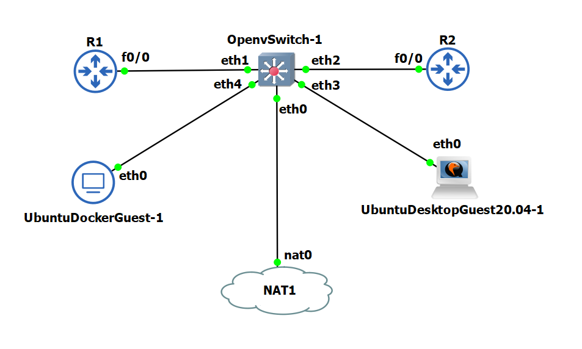
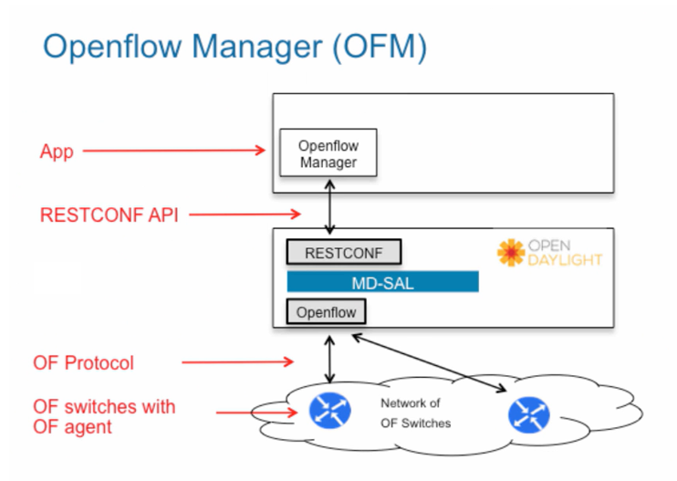

An illustration of small networking consisting of OpenvSwitch, some Routers, Docker container and a User agent.

Complete network traffic flow is controlled by OpenvSwitch. The OpenDayLight controller was used to configure traffic flows in the network.

This network was created in GNS3 application and OpenDayLight controller was installed and running from Ubuntu Docker.

Following is the Open Flow Manager Architecture;

